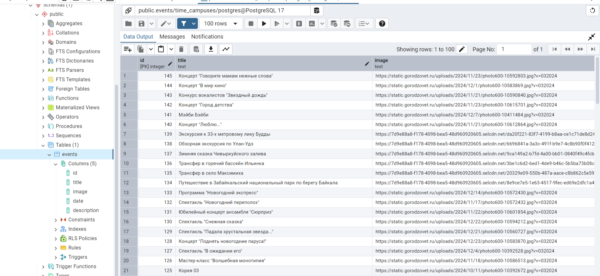

# TimeCampus
Над backend работают:
Айдажы
Дима

1. Получилось спарсить данные с сайта https://gorodzovet.ru/ulan-ude/ 
код в файле eventsAcrapers.js 
2. получилось сделать маленько APi, при запросе на 
```
http://localhost:3000/api/event 
```
получаем список мероприятий, файл routes

3. получилось добавить данные в БД спроектированную на posrgreSQL, но есть большое НО



При первом запросе все ОК
но при повторном запросе те же саммые данные добавляются повторно. 
Получаеться так, очень тяжолое БД с повторными значениями)) 

Выход: либо отменить парсинг и сделать возможность добавлять мероприятия самому через post запрос
или оставить данные с первого запроса и далее сделать возможность дополнять мероприятия самому через post
Но конечно на это времени нет)
