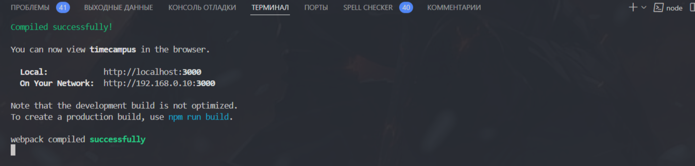

# Документация по фронтенду
Над frontend работают: Алина, Арюна, Влад

Фронтенд-сервер на React календарь студенческих мероприятий

1. Склонируй репозиторий к себе локально в vs Code, урок https://www.youtube.com/watch?v=W3Gb7QcsV-c
2. Открой терминал на vs code через cntrl + j 
3. В командной строке перейди к файлу cimecampus. Команда cd
4. Напиши в командоной строке код:
```
npm install
```
Убедитесь, что в файле timecampus есть папка node_modules

5. Напишите в командной строке https://create-react-app.dev/docs/getting-started/

```
npm start
```


Готово! 


Можете начать работать над frontend. 
